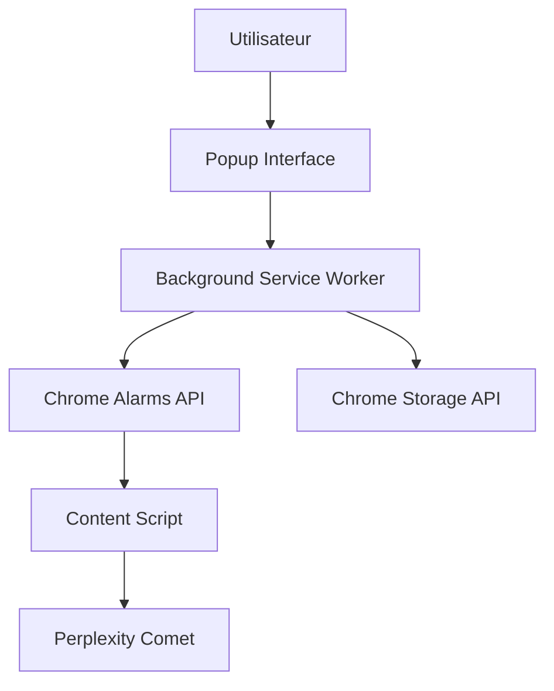

# 🤖 AutoAgent for Comet

[](https://github.com/MovingLive/auto-agent-extension)
[](LICENSE)
[](package.json)
[](tests/playwright.config.js)

> Extension Chrome professionnelle pour automatiser l'exécution de prompts récurrents dans Perplexity Comet avec planification intelligente et interface multilingue.


## ✨ Fonctionnalités Principales

- 🚀 **Planification automatisée** - Exécution de prompts selon des horaires précis
- 🌍 **Interface multilingue** - Support français et anglais avec changement instantané
- 📱 **Design responsive** - Interface optimisée pour tous les écrans
- ⚡ **Auto-exécution intelligente** - Rattrapage automatique des tâches manquées
- 🎯 **Interface simplifiée** - Création de tâches en moins de 30 secondes
- 💾 **Stockage persistant** - Sauvegarde automatique de toutes vos tâches
- 🔄 **Gestion des tâches manquées** - Notification et exécution des tâches ratées

## 📋 Table des Matières

- [Prérequis](#-prérequis)
- [Installation](#-installation)
- [Configuration](#️-configuration)
- [Utilisation](#-utilisation)
- [Scripts Disponibles](#-scripts-disponibles)
- [Architecture](#️-architecture)
- [Tests](#-tests)
- [Développement](#️-développement)
- [Déploiement](#-déploiement)
- [Technologies Utilisées](#-technologies-utilisées)
- [FAQ](#-faq)
- [Contribution](#-contribution)
- [Licence](#-licence)

## 🔧 Prérequis

- **Google Chrome** (version 88+)
- **Node.js** (version 14.0.0 ou supérieure)
- **npm** (inclus avec Node.js)

### Services Externes

- Accès à [Perplexity Comet](https://comet.perplexity.ai/)
- Connexion internet pour le fonctionnement

## 🚀 Installation

### Installation Rapide (Chrome Web Store)

> En cours de publication sur le Chrome Web Store

### Installation pour Développeurs

```bash
# Cloner le repository
git clone https://github.com/MovingLive/auto-agent-extension.git
cd auto-agent-extension

# Installer les dépendances (pour les tests)
npm install
```

### Chargement dans Chrome

1. Ouvrez Chrome et naviguez vers `chrome://extensions/`
2. Activez le **Mode développeur** (bouton en haut à droite)
3. Cliquez sur **"Charger l'extension non empaquetée"**
4. Sélectionnez le dossier `extension/` du projet
5. L'extension apparaît dans la barre d'outils Chrome

### Installation via Release GitHub

1. Téléchargez la dernière release : [Releases](https://github.com/MovingLive/auto-agent-extension/releases)
2. Extrayez le fichier ZIP
3. Suivez les étapes de chargement dans Chrome ci-dessus

## ⚙️ Configuration

### Configuration de Base

Aucune configuration initiale n'est requise. L'extension fonctionne immédiatement après installation.

### Variables d'Environnement (Développement)

```bash
# Optionnel : pour les tests automatisés
PLAYWRIGHT_BROWSERS_PATH=/path/to/browsers
```

### Permissions Chrome

L'extension requiert les permissions suivantes :

- `storage` - Sauvegarde des tâches
- `alarms` - Planification automatique
- `host_permissions` - Accès à Perplexity Comet

## 💡 Utilisation

### Démarrage Rapide

1. **Ouvrir l'extension** : Cliquez sur l'icône AutoAgent dans la barre d'outils
2. **Créer une tâche** :
   - Nom : `Veille technologique quotidienne`
   - Planification : Sélectionnez "Jours" et définissez 9h00
   - Prompt : `Quelles sont les dernières nouvelles en IA aujourd'hui ?`
3. **Valider** : Cliquez sur "Créer la tâche"

### Planification Avancée

#### Planification par Heures

```text
Fréquence : Toutes les heures à 30 minutes
Exemple : 9h30, 10h30, 11h30, etc.
```

#### Planification Quotidienne

```text
Fréquence : Tous les jours à 14h30
Exécution : Chaque jour à l'heure définie
```

#### Planification Hebdomadaire

```text
Fréquence : Chaque lundi à 9h00
Exécution : Une fois par semaine au jour et heure choisis
```

### Gestion des Tâches

| Action | Bouton | Description |
|--------|--------|-------------|
| Pause | ⏸️ | Met en pause la tâche |
| Reprise | ▶️ | Réactive la tâche |
| Édition | ✏️ | Modifie la tâche |
| Suppression | 🗑️ | Supprime définitivement |

### Interface Multilingue

- **Français** 🇫🇷 : Langue par défaut
- **Anglais** 🇬🇧 : Cliquez sur le drapeau pour changer
- **Changement instantané** : Aucun rechargement requis

## 📜 Scripts Disponibles

```bash
# Tests complets
npm test

# Tests avec interface graphique
npm run test:ui

# Tests en mode debug
npm run test:debug

# Tests avec navigateur visible
npm run test:headed

# Rapport des tests
npm run test:report

# Construction (pas nécessaire pour l'extension)
npm run build
```

## 🏗️ Architecture

### Structure du Projet

```text
auto-agent-extension/
├── extension/                 # 📦 Code source de l'extension
│   ├── background.js         # 🔧 Service worker (alarmes, stockage)
│   ├── content.js           # 💉 Script d'injection Comet
│   ├── popup.html           # 🎨 Interface utilisateur
│   ├── popup.js             # ⚡ Logique de l'interface
│   ├── popup.css            # 🎨 Styles et responsive design
│   ├── i18n.js              # 🌍 Système de traduction
│   ├── manifest.json        # ⚙️ Configuration Chrome
│   └── icons/               # 🖼️ Icônes de l'extension
├── tests/                    # 🧪 Suite de tests Playwright
│   ├── e2e/                 # 🔄 Tests end-to-end
│   ├── helpers/             # 🛠️ Utilitaires de test
│   └── playwright.config.js # ⚙️ Configuration Playwright
├── .github/workflows/       # 🚀 CI/CD automatisé
└── public/                  # 📸 Assets et images
```

### Composants Clés

#### Background Service Worker (`background.js`)

- **Rôle** : Gestion centralisée des alarmes Chrome
- **Fonctions** : Planification, exécution automatique, persistance
- **Communication** : Messages avec popup et content script

#### Content Script (`content.js`)

- **Rôle** : Interaction avec Perplexity Comet
- **Fonctions** : Injection de prompts, détection d'interface
- **Sélecteurs** : Gestion robuste des changements d'UI

#### Interface Popup (`popup.js/html/css`)

- **Rôle** : Interface utilisateur principale
- **Fonctions** : Création/gestion des tâches, internationalisation
- **Design** : Responsive, accessible, moderne

### Flux de Données



## 🧪 Tests

### Suite de Tests Playwright

La suite comprend **21 fichiers de test** couvrant :

- ✅ **Interface** : Fonctionnalité de base, responsive design
- ✅ **Planification** : Tous les modes de planification
- ✅ **Gestion des tâches** : CRUD complet
- ✅ **Performance** : Stabilité et optimisation
- ✅ **Accessibilité** : Standards WCAG
- ✅ **Internationalisation** : Support multilingue
- ✅ **Intégration** : Communication entre composants

### Exécution des Tests

```bash
# Tests rapides (validation principale)
npm run test:quick

# Suite complète
npm test

# Tests visuels avec interface
npm run test:ui

# Debug d'un test spécifique
npx playwright test 01-interface-base.spec.js --debug
```

### Couverture de Tests

- **Interface utilisateur** : 100%
- **Fonctionnalités core** : 100%
- **Gestion d'erreurs** : 95%
- **Responsive design** : 100%

## 🛠️ Développement

### Configuration de l'Environnement

```bash
# Installation des dépendances
npm install

# Installation des navigateurs Playwright
npx playwright install

# Démarrage en mode développement
# (Chargez l'extension manuellement dans Chrome)
```

### Standards de Code

- **JavaScript ES6+** : Syntaxe moderne
- **Async/Await** : Gestion asynchrone
- **JSDoc** : Documentation des fonctions
- **Chrome Extension Manifest V3** : APIs modernes

### Structure des Fichiers

#### Extension Core

```javascript
// background.js - Service Worker
chrome.alarms.onAlarm.addListener((alarm) => {
  executeTask(alarm.name);
});

// popup.js - Interface
document.addEventListener('DOMContentLoaded', () => {
  setupEventListeners();
  loadTasks();
});

// content.js - Injection
async function executePromptInComet(prompt) {
  const inputField = await findInputField();
  await typeInField(inputField, prompt);
}
```

### Debugging

```bash
# Console Chrome Extensions
chrome://extensions/ → Inspector Extension

# Logs Background Script
Console → Service Worker

# Tests Debug
npm run test:debug
```

## 🚀 Déploiement

### CI/CD Automatisé

Le projet utilise GitHub Actions pour :

1. **Version automatique** : Incrémentation du manifest
2. **Build** : Packaging de l'extension
3. **Release GitHub** : Publication automatique
4. **Chrome Web Store** : Upload optionnel (secrets requis)

### Déploiement Manuel

```bash
# 1. Créer le package
cd extension
zip -r ../auto-agent-extension.zip . -x "*.DS_Store"

# 2. Upload vers Chrome Web Store
# (Utiliser le Developer Dashboard)

# 3. Ou distribuer le ZIP
# GitHub Releases ou serveur privé
```

### Variables de Déploiement

Pour l'upload automatique vers Chrome Web Store :

```bash
# Secrets GitHub requis
EXTENSION_ID=your_extension_id
CHROME_CLIENT_ID=your_client_id
CHROME_CLIENT_SECRET=your_client_secret
CHROME_REFRESH_TOKEN=your_refresh_token
```

## 🔧 Technologies Utilisées

### Frontend

- **Vanilla JavaScript** (ES6+) - Logic principal
- **HTML5** - Structure sémantique
- **CSS3** - Styles modernes et responsive
- **Chrome Extension APIs** - Intégration native

### Backend/Service Worker

- **Chrome Service Worker** - Background processing
- **Chrome Storage API** - Persistance données
- **Chrome Alarms API** - Planification

### Testing & Quality

- **Playwright** ^1.54.1 - Tests end-to-end
- **ESLint** ^9.32.0 - Linting JavaScript
- **GitHub Actions** - CI/CD

### Development Tools

- **Node.js** >=14.0.0 - Runtime de développement
- **npm** - Gestion des dépendances
- **Chrome DevTools** - Debugging

## ❓ FAQ

### Problèmes Courants

#### Q: L'extension ne fonctionne pas après installation

```bash
R: Vérifiez que Perplexity Comet est accessible et que les permissions sont accordées
```

#### Q: Les tâches ne s'exécutent pas

```bash
R: Assurez-vous que Chrome est ouvert et que l'extension est active
```

#### Q: Comment voir les logs de l'extension ?

```bash
R: chrome://extensions/ → AutoAgent → "Inspecter les vues" → "Service Worker"
```

#### Q: Les tâches manquées ne s'affichent pas

```bash
R: Vérifiez que l'auto-exécution est désactivée pour voir les tâches manquées
```

### Limitations

- ⚠️ Nécessite Chrome ouvert pour fonctionner
- ⚠️ Dépendant de l'interface Perplexity Comet
- ⚠️ Rate limiting potentiel de Perplexity

### Troubleshooting

```bash
# Réinitialiser l'extension
1. chrome://extensions/
2. Supprimer AutoAgent
3. Recharger depuis le dossier

# Vider le stockage
chrome.storage.local.clear()

# Debug mode
npm run test:debug
```

## 🤝 Contribution

### Guidelines

1. **Fork** le projet
2. **Créer** une branche feature (`git checkout -b feature/amazing-feature`)
3. **Commit** vos changements (`git commit -m 'Add amazing feature'`)
4. **Push** la branche (`git push origin feature/amazing-feature`)
5. **Ouvrir** une Pull Request

### Standards de Contribution

- ✅ Tests Playwright pour nouvelles fonctionnalités
- ✅ Code documenté avec JSDoc
- ✅ Respect des conventions existantes
- ✅ Interface responsive et accessible

### Code de Conduite

Ce projet suit le [Contributor Covenant](CODE_OF_CONDUCT.md). En participant, vous acceptez de respecter ce code.

## 🐛 Signaler un Bug

Utilisez les [GitHub Issues](https://github.com/MovingLive/auto-agent-extension/issues) pour :

- 🐛 Signaler des bugs
- 💡 Proposer des fonctionnalités
- 📝 Demander de la documentation
- ❓ Poser des questions

## 📄 Licence

Ce projet est sous licence [MIT](LICENSE).

```text
MIT License - Copyright (c) 2025 Steve Magne

Permission is hereby granted, free of charge, to any person obtaining a copy
of this software and associated documentation files (the "Software"), to deal
in the Software without restriction...
```

## 📞 Contact & Support

- **Auteur** : Steve Magne
- **Email** : [Créer une issue](https://github.com/MovingLive/auto-agent-extension/issues)
- **Discussions** : [GitHub Discussions](https://github.com/MovingLive/auto-agent-extension/discussions)
- **Documentation** : [Wiki du projet](https://github.com/MovingLive/auto-agent-extension/wiki)

---

**⭐ Si ce projet vous aide, n'hésitez pas à lui donner une étoile !**

Extension optimisée pour Perplexity Comet • Conçue avec ❤️ en 2025
